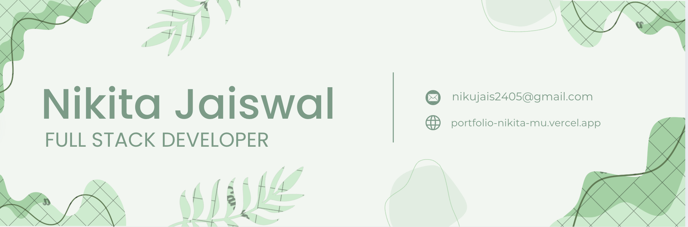

Hey there 👋

I’m Nikita, a senior full-stack engineer and creative coder who specializes in front-end and backend development. My vision is to transform user problems into effective solutions by building interactive, scalable websites and integrating AI to solve real-world challenges.

Want to know more about me? [Check out my portfolio.](https://nikitajaiswaldev.github.io/portfolio-nikita/)

## 📝 Latest Blog Posts

 

<!-- BLOG-POST-LIST:START -->
- [Microservices Architecture](https://nikujais.medium.com/microservices-architecture-why-when-and-how-it-outperforms-monolithic-design-1ce3af126f6d)
- [Google Cloud Pub/Sub](https://nikujais.medium.com/pub-sub-publisher-subscriber-3153d69b9f3b)
- [useDeferredValue and useTransition Hook](https://nikujais.medium.com/usedeferredvalue-and-usetransition-hook-7fa0fb4f5caf)
- [Web Workers in JavaScript](https://nikujais.medium.com/web-workers-in-javascript-c182692ada55)
- [JavaScript’s Recently Introduced Array Methods](https://nikujais.medium.com/must-know-javascripts-recently-introduced-array-methods-6fc69a92b199)
<!-- BLOG-POST-LIST:END -->

 

## 💼 Skills

### 🚀 Frontend  

### 🛠 Backend (JavaScript & Python)  

  

### ☁️ Cloud & DevOps  

  

### 🗄 Databases  

 

## 🌟 Parting Words

“Code with passion, ship with purpose.”

— Nikita
